# Lapres Modul 2 Jarkom T02 2020

#### Oleh :
- Muhammad Sulthon Nashir (0511174000017)
- Bagas Immanuel Lodianto (05311840000026)

## No 1
### Membuat Website dengan alamat semeruyyy.pw

Membuat file dengan nama alamat di /etc/bind

Membuat file di /etc/bind/named.conf.local

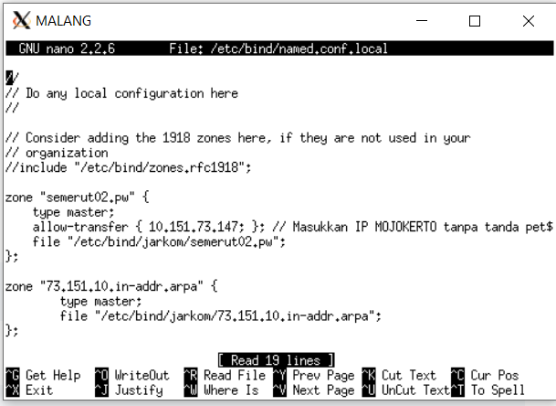

## No 2
### Membuat alias dengan www.semeruyyy.pw (CNAME Record)
mengedit file yang ada di /etc/bind
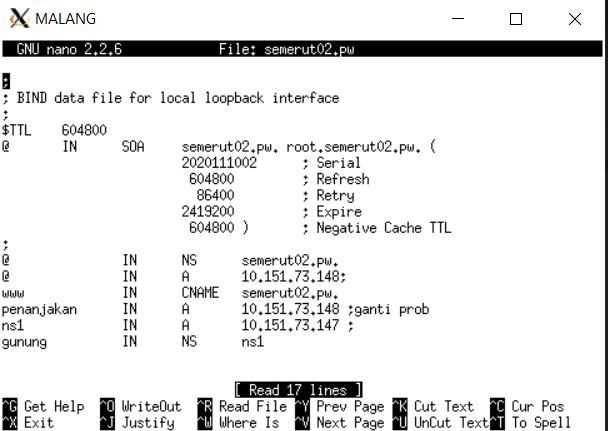

## No 3
### Membuat Sub Domain penanjakan dan diarahkan ke Probolinggo 
mengedit file yang ada di /etc/bind

## No 4
### Reverse Domain untuk Domain utama 
mengedit file yang ada di /etc/bind/named.local.conf

## No 5
### Membuat Mojokerto menjadi DNS Slave dari Malang

Setting pada Malang Allow transfer

Setting pada Mojokerto Sebagai slave 

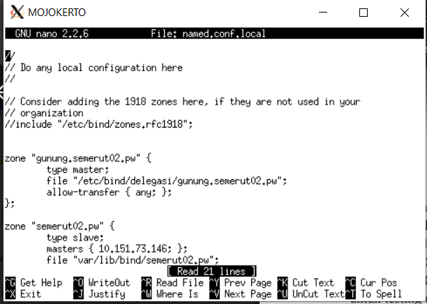

## No 6
### Membuat Delegasi subdomain

Setting pada Malang untuk delegasi (NS1)
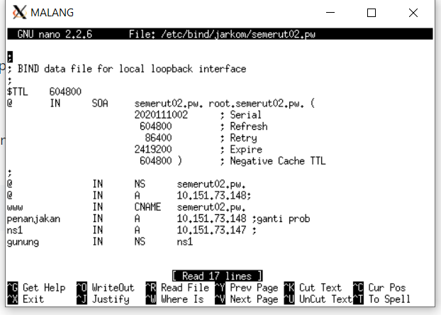

Setting pada Malang untuk delegasi (Allow query any)
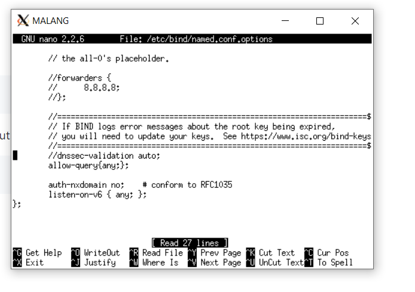

Allow Transfer
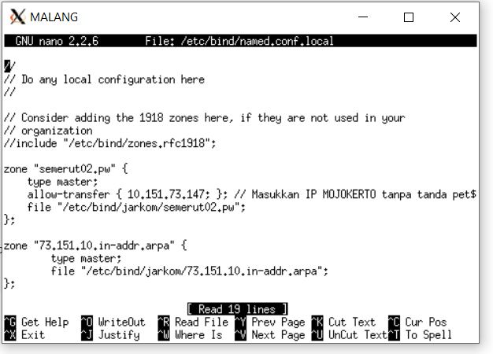

Setting di Mojokerto allow transfer any
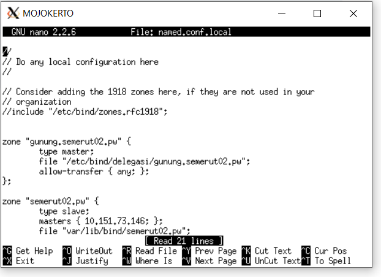

Setting allow Query any
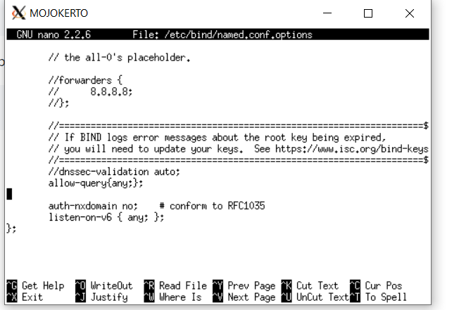

## No 7 
### Membuat Subdomain naik.gunung.semeruyyy.pw

Membuat file di /etc/bind
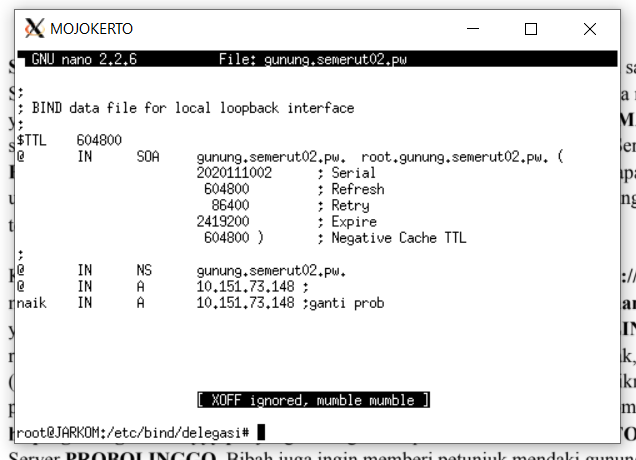

## No 8

### Mengatur Web Server untuk semeruyyy.pw

Membuat file di /etc/apache2/sites-available
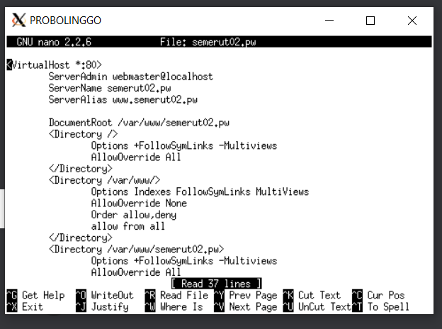

Membuat Document root di /var/www/
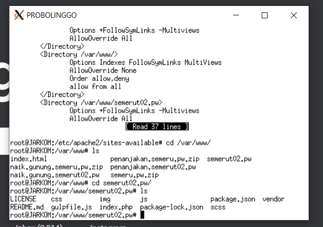

Maka hasilnya

## No 9
### Aktifkan Mod Rewrite sehingga index.php hilang

Membuat file .htaccess pada root folder dari semeruyyy.pw
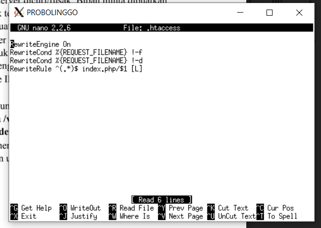

Maka Hasilnya
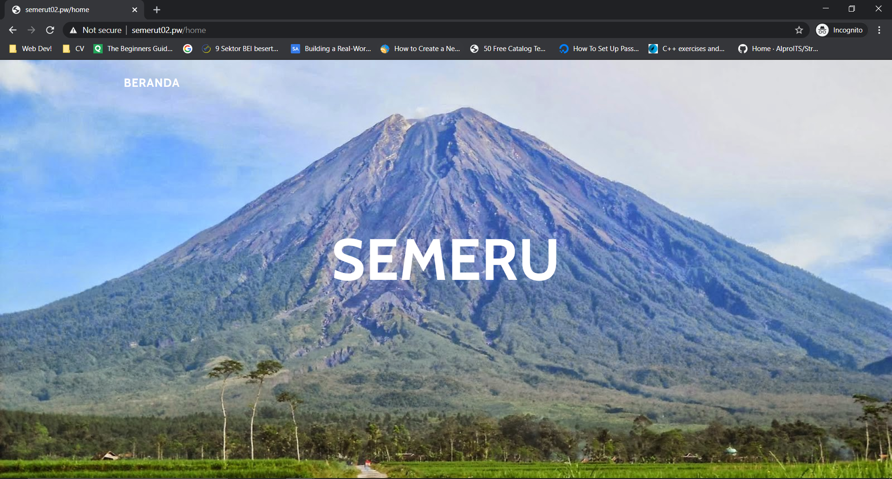

## No 10
### Membuat Web lagi dengan nama penanjakan.semeruyyy.pw

Membuat Document root di /var/www
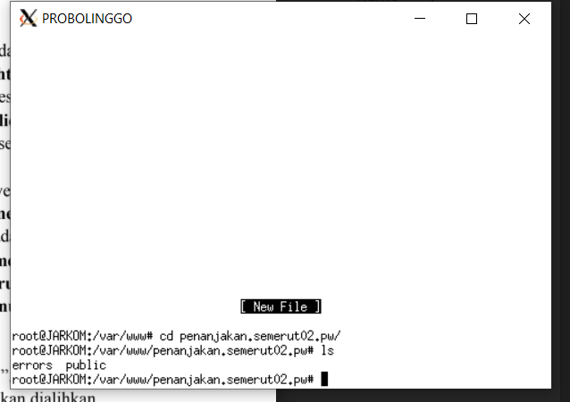

Membuat file /etc/apache2/sites-available
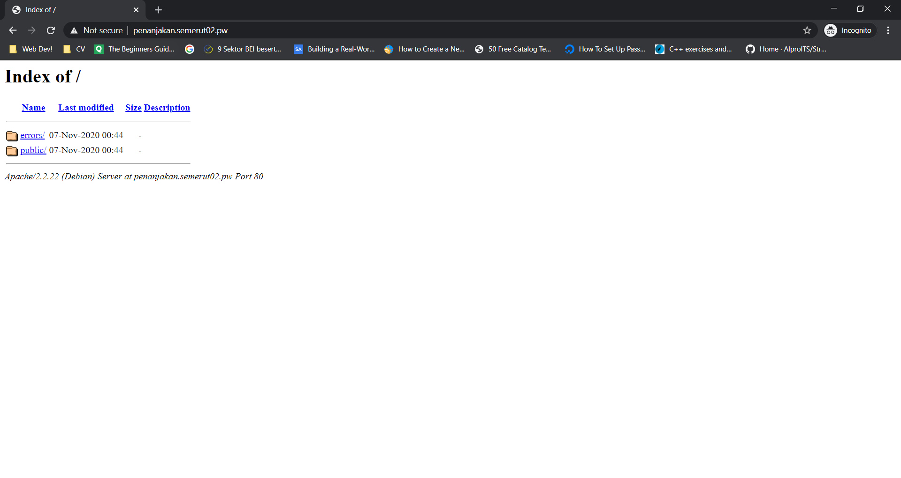

## No 11
### Public boleh di akses, folder isinya public tidak boleh

Mengbubah file yang ada di /etc/apache2/sites-available agar mematikan option indexes

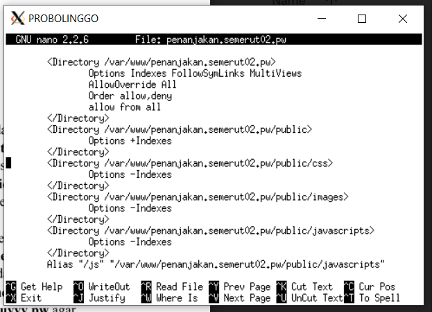

## No 12
### Redirect url yang tidak valid ke 404.html

Membuat file .htaccess yang melakukan redirect
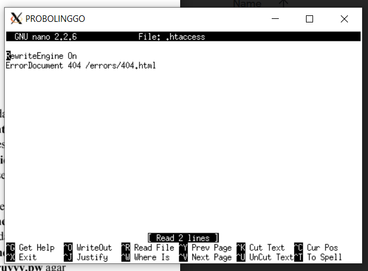

## No 13
### Membuat Alias javascript jadi /js 

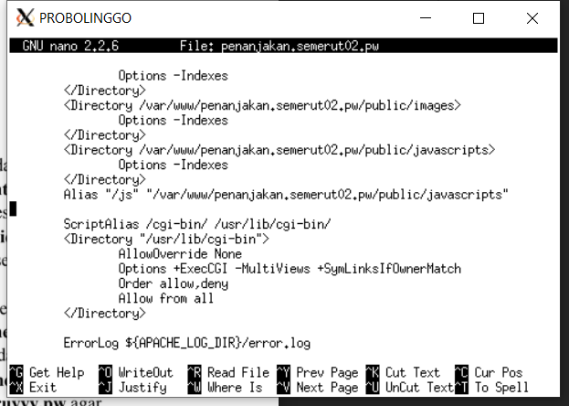

## No 14
### Membuat web naik.gunung.semerut02.pw dengan port 8888

Tinggal buat di sites-available naik.gunung.semeru02.pw dengan port 8888. Lalu tambahkan lister 8888 di ports.conf.
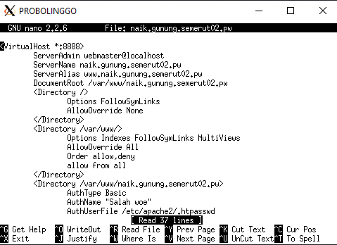

## No 15
### Set username dan password di naik.gunung.semerut02.pw

Pertama buat username dan password di file .htpasswd dengan htpasswd. Bisa dilihat kalau password terenkripsi.
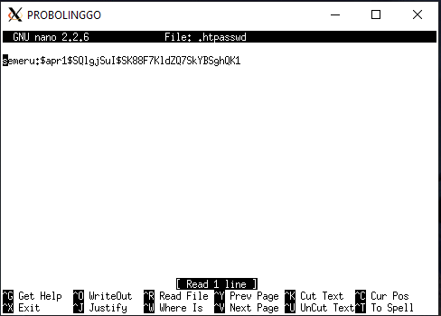
Lalu cek ulang di naik.gunung.semerut02.pw
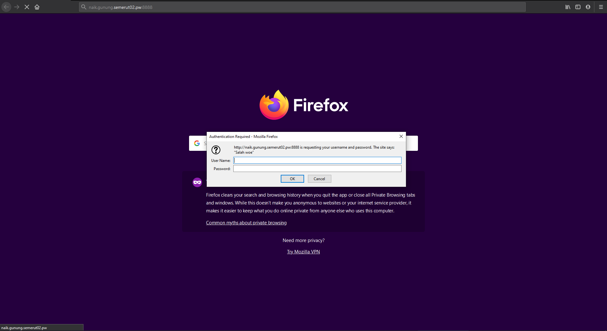
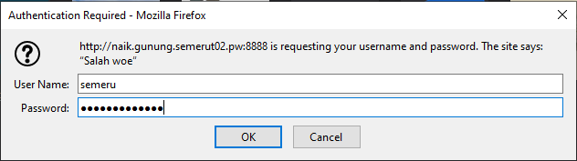

## No 16
### Redirect IP Probolinggo ke semeruyyy.pw

Mengedit file yang ada di /etc/apache2/sites-available/default
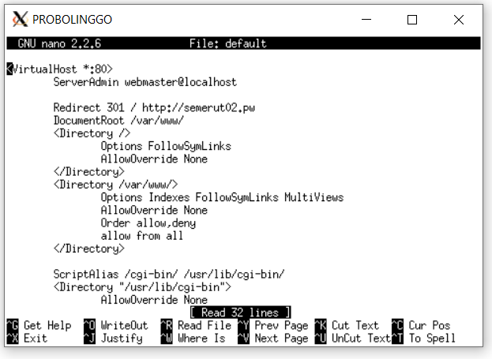

## No 17
### Jika URL mengandung Substring semeru redirect ke semeru.jpg

Membuat File .htaccess yang mengandung regex dan melakuakn redirect yang diletakkan di root
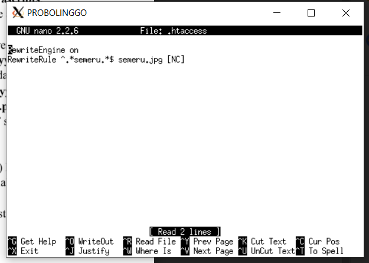
